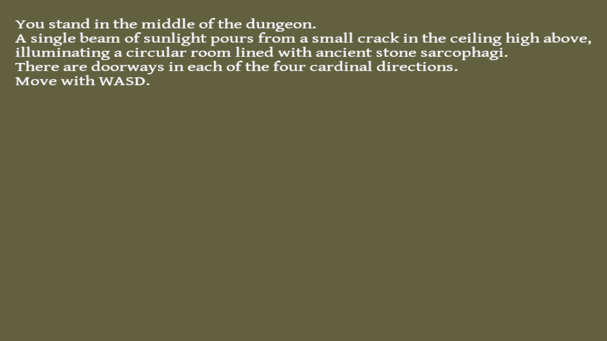

# Dungeon Dude

Author: Jesse Liu

Design: This was originally supposed to be a text-based dungeon exploration game in which you pick up after the deaths of your previous characters. Unfortunately, I wasn't able to get the text rendering working in time (honestly I'm still not satisfied with how it looks), so the gameplay is currently limited to walking around five rooms.

Text Drawing: Textures are generated for the most common characters in English at runtime, and those are used to draw the input strings. This is the method used in OpenGL's text rendering tutorial (https://learnopengl.com/In-Practice/Text-Rendering).

Choices: Right now, it only stores the player's x and y positions in a tiny map, where x corresponds to E/W and y corresponds to N/S. I had planned to have a much bigger map, as well as a player inventory and dungeon puzzle state based on the actions of past player characters. You would've been able to find your past corpses and loot them, too.

Screen Shot:

How To Play:

Right now, all you can do is move around the map with WASD.

Sources: GentiumBookPlus-Regular.ttf (see README-fonts-OFL.txt): https://fonts.google.com/specimen/Gentium+Book+Plus

Parts of this program are based off of code from lecture/Discord by Jim McCann, the Harfbuzz tutorial (https://github.com/harfbuzz/harfbuzz-tutorial/blob/master/hello-harfbuzz-freetype.c), the Freetype tutorial (https://freetype.org/freetype2/docs/tutorial/step1.html), and the OpenGL text rendering tutorial (https://learnopengl.com/In-Practice/Text-Rendering)

This game was built with [NEST](NEST.md).

